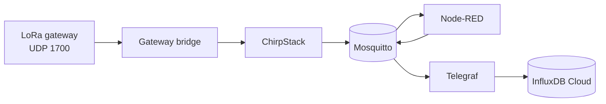

# Documentation hub

All docs for **Rpi-central-device**: LoRaWAN network server (ChirpStack), MQTT (Mosquitto), Node-RED, optional **LoRa dashboard**, Telegraf, and **InfluxDB Cloud**.

**Start here:** [LoRa pipeline explained](lora-pipeline-explained.md) if you are new to the uplink path, then skim service docs as needed.

**Edge devices** that pair with this central stack: [Related projects](related-projects.md) ([LorBeePlugin](https://github.com/mjospovich/LorBeePlugin), [Rpi-edge-alert](https://github.com/mjospovich/Rpi-edge-alert)).

---

## Recommended reading order

1. [LoRa pipeline explained](lora-pipeline-explained.md) — sensor → gateway → ChirpStack → MQTT → Influx  
2. [LoRa dashboard](lora-dashboard.md) — live MQTT + downlinks (optional; needs `CHIRPSTACK_API_TOKEN`)  
3. [ChirpStack](chirpstack.md) — UI, applications, MQTT integration, example codec (DL-IAM)  
4. [Mosquitto](mosquitto.md) — broker topics and debugging  
5. [Node-RED](nodered.md) — how uplinks become `nodered/lorawan/...`  
6. [Telegraf](telegraf.md) + [InfluxDB Cloud](influxdb.md) — env vars and writes  
7. [Grafana](grafana.md) — optional dashboards  

Operational / hardware-specific guides:

8. [Gateway setup (Laird RG1xx)](gateway-setup-laird-rg1xx.md) — Semtech forwarder → UDP 1700  
9. [Sensor payload byte budget](sensor-payload-byte-budget.md) — *optional* deep dive on compact binary payloads (useful when designing codecs)  
10. [References & upstream](references.md) — credit and links for ChirpStack, Mosquitto, Telegraf, etc.

---

## Service reference

| Document | What it covers |
|----------|----------------|
| [ChirpStack](chirpstack.md) | `chirpstack`, gateway bridge, REST API, Postgres/Redis, region/MQTT |
| [Mosquitto](mosquitto.md) | Broker config, topic summary, debug commands |
| [Node-RED](nodered.md) | Flow file, ChirpStack → Telegraf topic contract |
| [Telegraf](telegraf.md) | MQTT inputs, `influxdb_v2` output |
| [InfluxDB Cloud](influxdb.md) | `INFLUX_*` variables, Cloud-only (no local Influx container) |
| [LoRa dashboard](lora-dashboard.md) | Flask UI on **:3000** — MQTT uplinks, LorBee / DL-IAM downlinks |
| [Grafana](grafana.md) | Flux data source against the same Cloud org |
| [References & upstream](references.md) | Links to ChirpStack, Eclipse, InfluxData, Decentlab, … |

---

## Guides & ecosystem

| Document | What it covers |
|----------|----------------|
| [LoRa pipeline explained](lora-pipeline-explained.md) | Step-by-step narrative for newcomers |
| [LoRa dashboard](lora-dashboard.md) | Edge control UI — setup, API, downlink families |
| [Gateway setup (Laird RG1xx)](gateway-setup-laird-rg1xx.md) | Example gateway configuration |
| [Sensor payload byte budget](sensor-payload-byte-budget.md) | Byte-level payload planning (LoRa-oriented) |
| [Related projects](related-projects.md) | **LorBeePlugin**, **Rpi-edge-alert**, and how they talk to this central device |
| [References & upstream](references.md) | ChirpStack, Mosquitto, Telegraf, InfluxDB, Decentlab, Grafana — links and roles |

---

## Data flow (summary)

ChirpStack publishes decoded frames to `application/<app_id>/device/<dev_eui>/event/up`. Node-RED republishes flattened JSON to `nodered/lorawan/...` for Telegraf.

---

## URLs (replace host)

| URL | Service |
|-----|---------|
| `http://<host>:8081` | ChirpStack UI |
| `http://<host>:8090` | ChirpStack REST API |
| `http://<host>:1880` | Node-RED editor |
| `https://<your-cloud-region>...` | InfluxDB Cloud (`INFLUX_URL` in `.env`) |
| `http://<host>:3000` | LoRa dashboard |
| `mqtt://<host>:1883` | Mosquitto |
